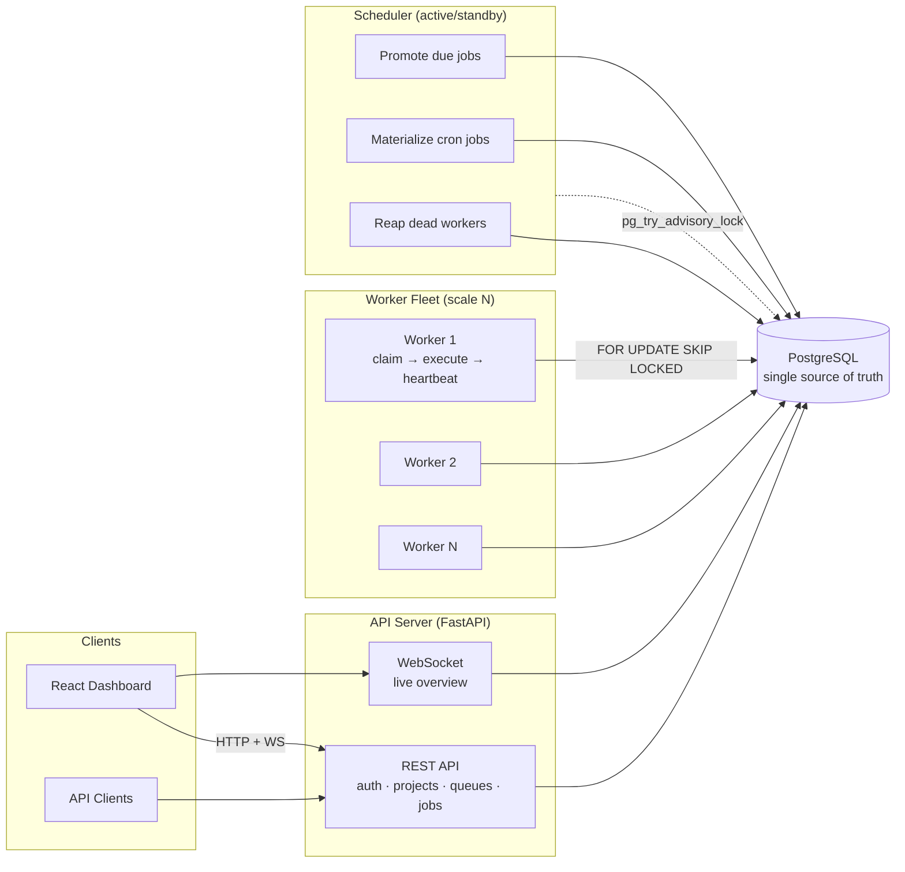
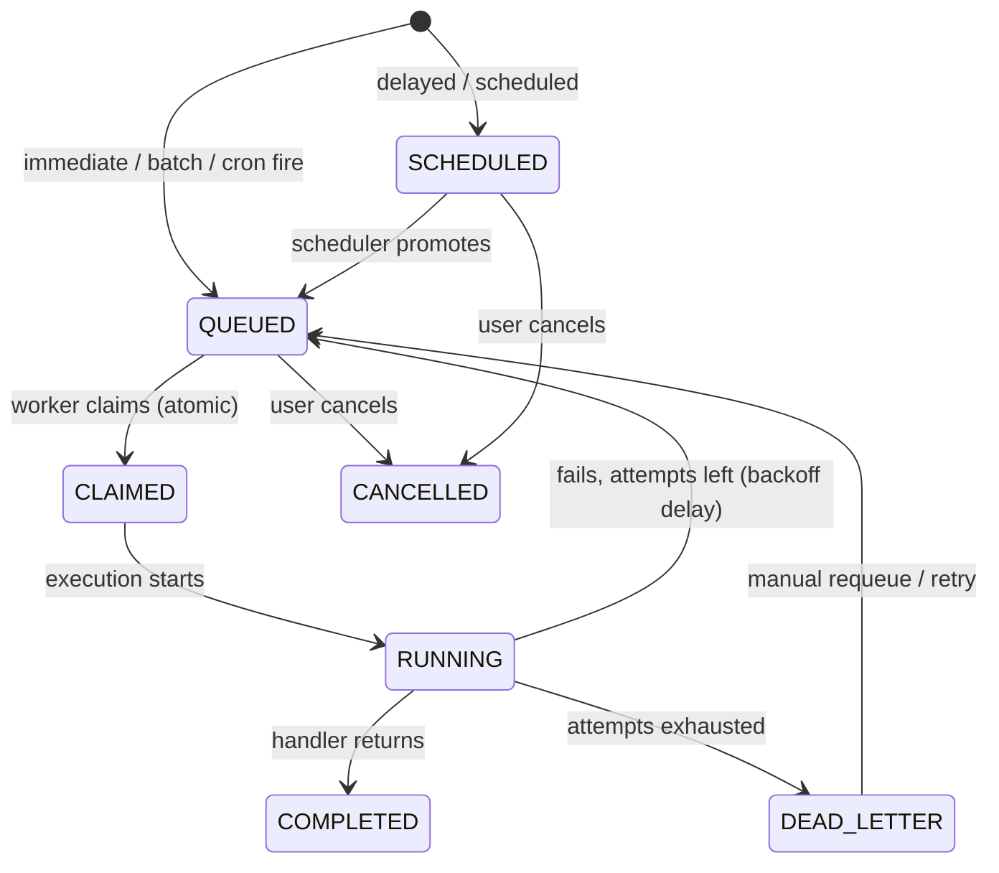

# Architecture

## Components

**API server** (`app/main.py`) — stateless FastAPI process serving the REST API
and a WebSocket that pushes system snapshots every 2s. Scales horizontally
behind any load balancer; all state lives in Postgres.

**Worker service** (`app/worker.py`) — a separate deployable. Loop:

1. Compute spare capacity (`concurrency − in-flight`).
2. Atomically claim up to that many due jobs in **one UPDATE with a
   `FOR UPDATE SKIP LOCKED` subquery** — competing workers skip locked rows
   instead of blocking, so N workers drain queues in parallel with zero
   double-claims.
3. Execute each job in a thread pool; record a `job_executions` row per attempt
   and stream log lines to `job_logs`.
4. Heartbeat every 10s (updates `workers.last_heartbeat_at` + appends history).
5. On SIGTERM/SIGINT: stop claiming, finish in-flight jobs (DRAINING), mark
   OFFLINE, exit.

**Scheduler service** (`app/scheduler.py`) — the only singleton, made safe to
replicate via a **Postgres advisory lock**: every instance contends for
`pg_try_advisory_lock`; the winner runs, the rest idle as hot standbys and take
over if the winner's connection dies. Each 1s tick:

- promotes `SCHEDULED` jobs whose `run_at` arrived to `QUEUED`;
- materializes due cron templates into concrete jobs and advances `next_run_at`
  (`FOR UPDATE SKIP LOCKED` on templates for safety);
- **reaps dead workers**: any worker silent past the heartbeat deadline is
  marked `DEAD`, its open execution marked `LOST`, and its in-flight jobs sent
  through the normal retry/DLQ path (an interrupted run consumes an attempt so
  a crash-looping job cannot spin forever).

**Dashboard** — React SPA. Pages poll every 3–4s; the overview page receives
WebSocket pushes. Served by nginx in Docker, which also proxies `/api`.

## Job lifecycle

## Delivery semantics

The platform guarantees **at-least-once** execution: if a worker dies after
side effects but before recording completion, the job runs again. Exactly-once
is impossible without cooperation from the job's side effects, so instead:

- job **creation** is idempotent via `idempotency_key` (unique per queue);
- handlers are documented as needing to be idempotent;
- every attempt is recorded, so duplicates are visible and auditable.
