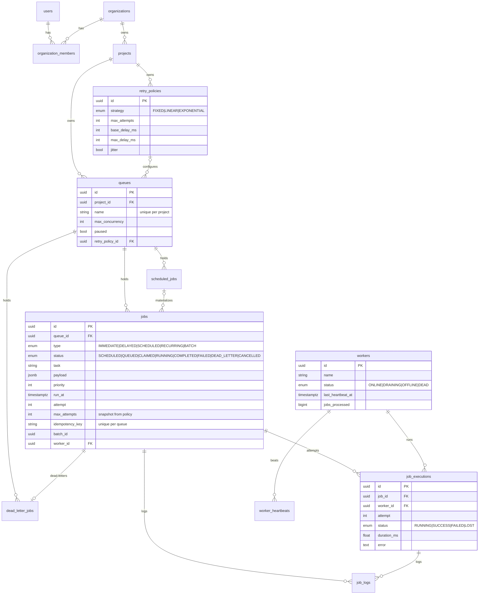

# Database Design

(12 entities total; `users`, `organizations`, `organization_members`, `projects`,
`job_logs`, `worker_heartbeats`, `scheduled_jobs`, `dead_letter_jobs` carry the
obvious columns — see `backend/app/models.py` for the full definitions.)

## Keys and identity

- **UUID primary keys** everywhere: IDs can be generated by any process (API,
  worker, tests) without a round-trip or coordination, and they don't leak row
  counts. Trade-off: 16 bytes vs 8 and worse index locality than bigserial —
  acceptable at this scale, and documented as swappable for UUIDv7 at volume.
- `job_logs` / `worker_heartbeats` use **bigserial** PKs — they're append-only,
  high-volume, and never referenced externally, so insert locality matters more.

## Foreign keys & cascading

- `org → project → queue → job → execution → log` all cascade on delete:
  removing a tenant tree removes its operational data. This is the natural
  ownership hierarchy, so cascade is safe.
- `jobs.worker_id`, `executions.worker_id` use **SET NULL** — deleting a worker
  must never delete job history.
- `queues.retry_policy_id` uses **SET NULL** — deleting a policy reverts the
  queue to default retry behavior rather than breaking it.
- `dead_letter_jobs.job_id` is **UNIQUE** — one live DLQ entry per job; a
  requeued job that dies again *updates* its entry (regression-tested).

## Indexes (the interesting ones)

| Index | Purpose |
|---|---|
| `ix_jobs_claim (queue_id, run_at, priority) WHERE status='QUEUED'` | **The claim hot path.** Partial: only claimable rows are indexed, keeping it tiny no matter how much history accumulates. |
| `uq_jobs_idempotency (queue_id, idempotency_key)` | Idempotent job creation. |
| `ix_scheduled_next_run (next_run_at, enabled)` | Scheduler's cron scan. |
| `ix_executions_job (job_id, attempt)` | Attempt timeline on the job detail page. |
| `ix_job_logs_job (job_id, created_at)` | Log viewer, chronological. |
| `workers.last_heartbeat_at` | Reaper scan for stale workers. |

## Normalization & snapshots

The schema is in 3NF with one deliberate denormalization: `jobs.max_attempts`
is a **snapshot** of the queue's retry policy taken at enqueue time. Editing a
policy therefore never changes the semantics of jobs already in flight — the
alternative (joining to the live policy at failure time) makes retry behavior
change retroactively, which is surprising and untestable.

## Performance considerations

- Claiming is a single-statement UPDATE; the partial index keeps it O(limit).
- Job history grows unbounded by design (it *is* the audit trail); the tables
  that would actually hurt (`job_logs`, `worker_heartbeats`) are pruned
  (heartbeats) and capped per query (logs), and both are ready for time-based
  partitioning at scale.
- Queue stats aggregate with `GROUP BY status` over an indexed FK — fine at
  this scale; at 10x these become materialized counters updated by triggers or
  a rollup job (documented trade-off, not needed yet).
